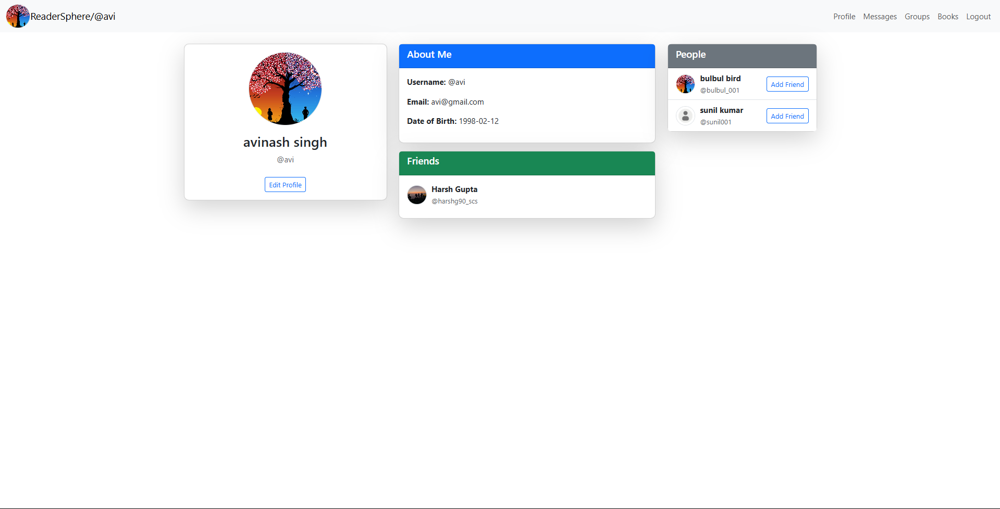
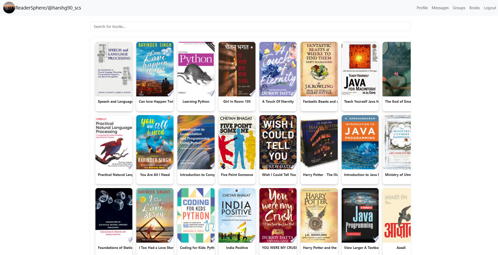
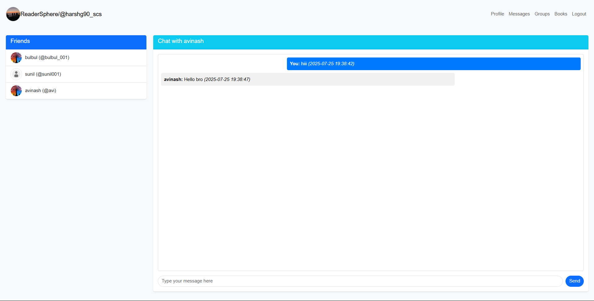
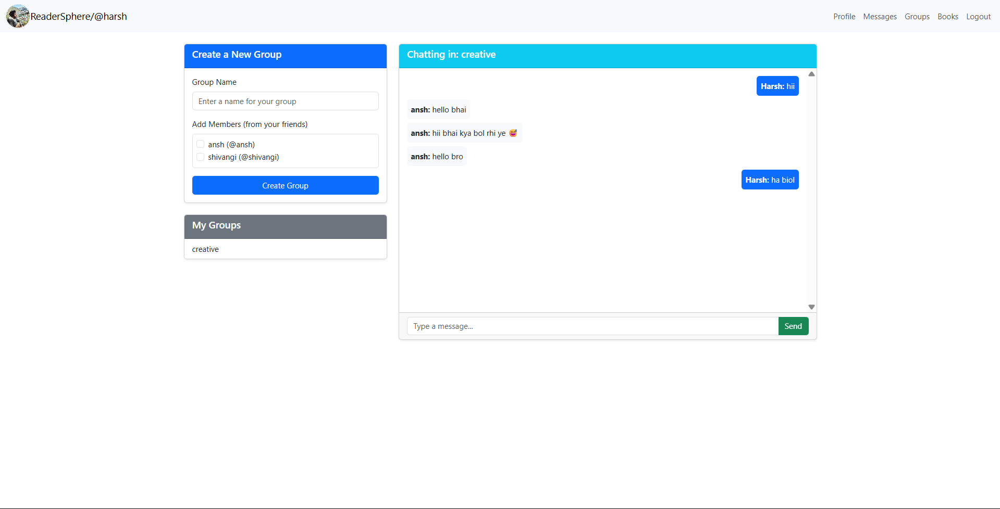

# 📚 ReaderSphere

**ReaderSphere** is a social media platform built for book lovers — a space to connect, share, and chat about your favorite reads. Whether you're looking to discuss novels, make friends with similar interests, or explore new book recommendations, ReaderSphere has something for every reader.

---

## 📸 Screenshots

### 🔐 Profile  
  
*User profile view and editing (bio, profile pic, DOB).*

### 📚 Book Search  
  
*Search books using metadata (scraped with BeautifulSoup).*

### 💬 Messaging  
  
*Real-time 1-on-1 messaging using WebSockets.*

### 👥 Groups  
  
*Create spaces to discuss books with like-minded readers.*

---

## 🌟 Features

- 👤 **User Authentication & Profile Creation**  
  Secure login, registration, and profile setup.

- 📚 **Books Section (Metadata Search)**  
  Search for books using online metadata (scraped via BeautifulSoup + Google API).

- 💬 **Real-Time Messaging**  
  1-on-1 messaging using WebSockets for instant communication.

- 🤝 **Friend Requests**  
  Send/receive friend requests, also powered by WebSockets.

- 🔎 **User Search**  
  Search users by username to connect with fellow readers easily.

- 🧠 **Friend Suggestions (NEW!)**  
  Get personalized friend recommendations based on shared book genre preferences using a cosine similarity engine over user genre vectors.

- 📝 **Profile Editing**  
  Update your bio, profile picture, and date of birth.

- 👥 **Group Chats**  
  Users can create groups and add their friends to spark discussions around shared genres, authors, or interests.

- ⭐ **Book Ratings**  
  Rate books you’ve read and explore community ratings on each book page.

- 🏆 **Leaderboard**  
  Discover the most active users and top-rated books across the platform.

- ☁️ **Cloud Storage (S3)**  
  Profile pictures are stored on **AWS S3** for reliability and performance.
  
- 🔒 **AES-Encrypted Messages (NEW!)**  
  All private and group messages are encrypted at rest using AES encryption to enhance user privacy and prevent data leakage even in the event of a database breach.

---

## ⚙️ Architecture & Deployment

ReaderSphere is designed with a modular architecture and is deployed using **Render**, with AWS used for media storage.

### 🧱 Application Architecture

- Flask-based **REST API** backend  
- Templated **HTML/CSS/JS frontend** (Jinja2)  
- **WebSocket** support via Flask-SocketIO  
- Book metadata scraping via **BeautifulSoup** + Google Books API  
- Genre normalization using **Google Gemini API + JSON schema validation**  
- Cosine similarity engine for **friend recommendations**

### 🚀 Deployment

- **Render**: Hosts the full-stack web app  
- **Free PostgreSQL Hosting**: Stores users, messages, books, ratings, groups, suggestions, etc.  
- **AWS S3**: Manages profile picture uploads  
- **GitHub Actions**: CI/CD for code deployment and testing  

---

## 🛠️ Technologies Used

| Category           | Tech Stack                                           |
|--------------------|------------------------------------------------------|
| **Backend**        | Flask, Flask-SocketIO, RESTful APIs                  |
| **Frontend**       | HTML/CSS, JavaScript, Jinja2 Templates               |
| **Database**       | PostgreSQL (Free cloud DB provider)                  |
| **Web Scraping**   | BeautifulSoup, Google Books API                      |
| **ML/NLP**         | Google Gemini (for genre classification)             |
| **Friend Engine**  | Cosine Similarity (via NumPy + scikit-learn)         |
| **Cloud Platform** | **Render** (App Hosting), **AWS S3** (Media Storage) |
| **CI/CD**          | GitHub Actions                                       |

---

## 📦 Local Setup Instructions

1. **Clone the Repository**
   ```bash
   git clone https://github.com/2003HARSH/Readersphere.git
   cd Readersphere
   ```

2. **Create a Virtual Environment**

   ```bash
   python -m venv venv
   source venv/bin/activate  # On Windows: venv\Scripts\activate
   ```

3. **Install Dependencies**

   ```bash
   pip install -r requirements.txt
   ```

4. **Run the App**

   ```bash
   python app.py
   ```

   The app will be live at: `http://localhost:5000/`

---

## 📌 Roadmap

* ✅ Real-time 1-on-1 chat
* ✅ Book metadata scraping + search
* ✅ User profile creation and editing
* ✅ Group chat creation and management
* ✅ Book rating system
* ✅ Leaderboard
* ✅ Friend suggestion system
* ✅ User search functionality
* ✅ Render + S3 deployment
* 🚧 Book reviews and community discussions
* 🚧 Personalized book recommendation engine
* 🚧 Mobile-first responsive redesign

---

## 🤝 Contributing

Pull requests are welcome! For major changes, open an issue first to discuss what you’d like to improve or add.

---

## 📄 License

This project is licensed under the [MIT License](LICENSE).

---

## 📬 Contact

For suggestions, queries, or collaborations, feel free to reach out.

Made with ☕, frustration, and `websockets` by **Harsh Gupta**
GitHub: [@2003HARSH](https://github.com/2003HARSH)

