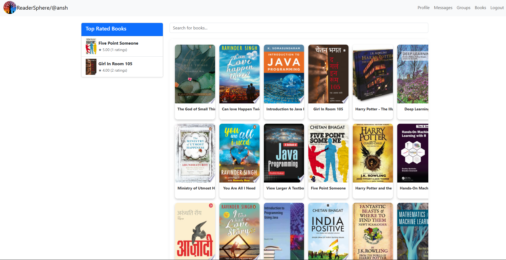

# 📚 ReaderSphere

**ReaderSphere** is a social media platform built for book lovers — a space to connect, share, and chat about your favorite reads. Whether you're looking to discuss novels, make friends with similar interests, or explore new book recommendations, ReaderSphere has something for every reader.

---

## 📸 Screenshots

### 🔐 Profile


*User profile view and editing (bio, profile pic, DOB).*

### 📚 Book Search


*Search books using metadata (scraped with BeautifulSoup).*

### 💬 Messaging


*Real-time 1-on-1 messaging using WebSockets.*

---

## 🌟 Features

* 👤 **User Authentication & Profile Creation**
  Secure login, registration, and profile setup.

* 📚 **Books Section (Metadata Search)**
  Search for books using online metadata (scraped using BeautifulSoup + Google API).

* 💬 **Real-Time Messaging**
  1-on-1 messaging using WebSockets for instant communication.

* 🤝 **Friend Requests**
  Send/receive friend requests, also powered by WebSockets.

* 🔎 **User Search**
  Search and connect with fellow book lovers by username.

* 📝 **Profile Editing**
  Update your bio, profile picture, and date of birth.

* ☁️ **Cloud Storage**
  Profile pictures are stored on **AWS S3**.

* 🧑‍🤝‍🧑 **Group Chats** *(in development)*
  Interest-based group chats to discuss genres, authors, and more.

---

## ⚙️ Architecture & Cloud Infrastructure

ReaderSphere is **cloud-native** and designed for scalability and performance using AWS infrastructure:

### 🧱 Application Architecture

* Modular **REST API** backend with Flask
* Web interface built using HTML/CSS/JS (Jinja templating)
* WebSocket support via **Flask-SocketIO**
* Web scraping with **BeautifulSoup** and Google API

### ☁️ Cloud Deployment (AWS)

* **Amazon ECS** (Fargate): Runs containerized Flask backend
* **Amazon ECR**: Stores Docker images for deployment
* **Amazon RDS (PostgreSQL)**: Managed relational DB for scalable storage
* **Amazon S3**: Profile picture storage and static assets
* **Application Load Balancer (ALB)**: Distributes traffic across containers
* **Auto Scaling Group (ASG)**: Automatically adjusts container count based on load
* **IAM Roles + Secrets Manager**: Secure handling of credentials and permissions

---

## 🛠️ Technologies Used

| Category             | Tech Stack                             |
| -------------------- | -------------------------------------- |
| **Backend**          | Flask, Flask-SocketIO, RESTful APIs    |
| **Database**         | PostgreSQL on AWS RDS  |
| **Frontend**         | HTML/CSS, JavaScript, Jinja2 Templates |
| **Web Scraping**     | BeautifulSoup, Google Books API        |
| **Containerization** | Docker, AWS ECS (Fargate)              |
| **CI/CD**            | GitHub Actions → ECR → ECS Deployment  |
| **Cloud Services**   | AWS S3, RDS, ECS, ECR, ALB, ASG        |

---

## 📦 Local Setup Instructions

1. **Clone the Repository**

   ```bash
   git clone https://github.com/2003HARSH/Readersphere.git
   cd Readersphere
   ```

2. **Create a Virtual Environment**

   ```bash
   python -m venv venv
   source venv/bin/activate  # Windows: venv\Scripts\activate
   ```

3. **Install Requirements**

   ```bash
   pip install -r requirements.txt
   ```

4. **Run the App**

   ```bash
   python app.py
   ```

   App will run at: `http://localhost:5000/`

---

## 🚀 Production Deployment (AWS)

ReaderSphere is fully containerized and deployed on AWS using the following pipeline:

1. **CI/CD** via **GitHub Actions** to build and push images to **ECR**
2. **ECS Fargate** for running containers without managing servers
3. **ALB + ASG** for load balancing and auto-scaling
4. **RDS PostgreSQL** for production-grade database
5. **S3** for storing profile pictures and static media

Want to deploy your own instance? Check out the [`infra/`](infra/) folder (coming soon) for Terraform/CloudFormation setup scripts.

---

## 📌 Roadmap

* ✅ Real-time messaging
* ✅ Book metadata search
* ✅ Profile creation and editing
* ✅ Cloud deployment (AWS: ECS, ALB, ASG, RDS, S3)
* 🚧 Group chats
* 🚧 Book reviews and ratings
* 🚧 Personalized recommendation engine

---

## 🤝 Contributing

Pull requests are welcome! For major changes, please open an issue first to discuss what you'd like to change.

---

## 📄 License

This project is licensed under the [MIT License](LICENSE).

---

## 📬 Contact

For suggestions, queries, or collaborations, feel free to reach out.

Made with ☕, frustration, and `websockets` by **Harsh Gupta**
GitHub: [@2003HARSH](https://github.com/2003HARSH)
